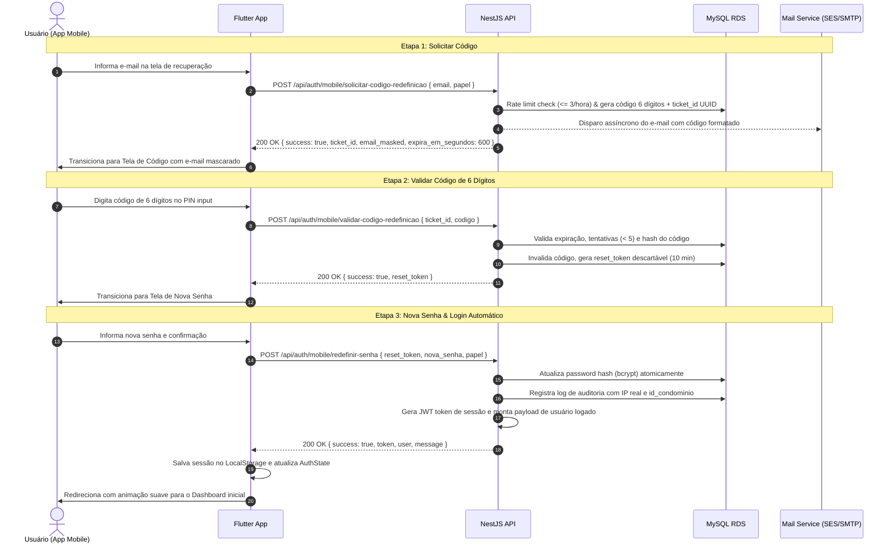

# Especificação Técnica: Recuperação de Senha por Código de 6 Dígitos no App Mobile

**Data:** 25/09/2026  
**Status:** Aprovado  
**Autores:** Engenharia Click Prestare  
**Escopo:** App Mobile (Flutter) e Backend API (NestJS + Prisma/MySQL)

---

## 1. Visão Geral e Objetivos

Atualmente, a recuperação de senha é disparada por e-mail com um link web que direciona o usuário para o portal Angular (`portaria-web`). Além disso, a tela atual de "Esqueci a senha" no aplicativo mobile possui um visual simplificado e genérico que diverge da identidade visual moderna da tela de login.

Esta especificação define:
1. **Fluxo 100% Nativo no App Mobile:**
   - O morador, síndico ou funcionário digita seu e-mail no aplicativo.
   - Um código numérico de 6 dígitos (2FA) é gerado e enviado por e-mail.
   - O usuário digita o código de 6 dígitos diretamente na tela do app.
   - O usuário define a nova senha na tela seguinte.
   - **Login Automático Imediato:** Ao salvar a nova senha, a API autentica o usuário, devolve o token JWT e o app transiciona diretamente para o Dashboard inicial, sem exigir nova digitação de credenciais.
2. **Identidade Visual Premium Padronizada:**
   - Todas as 3 telas do fluxo adotam rigorosamente o mesmo design system da tela de login:
     - `GridBackground` sutil com gradiente vertical.
     - Botão circular de voltar no topo esquerdo.
     - Marca e logotipo oficial `PRESTARE GESTÃO` com squircle e sombra suave.
     - Cartão central flutuante (`AppColors.surfaceElevated`) com cantos arredondados (`24px`).
     - Badge do perfil selecionado (ex: `🏠 Morador`, `🏢 Síndico`, `🛡️ Funcionário`).
     - Campos de entrada modernos (`AppInput`) e botão de ação azul vibrante com seta (`ENTRAR →`).
     - Rodapé com copyright institucional.

---

## 2. Arquitetura e Fluxo de Dados (Abordagem em 3 Etapas)



---

## 3. Modelo de Dados (MySQL / Prisma)

A tabela existente `redefinicoes_senha` será estendida para suportar tanto os links antigos quanto os novos desafios de código de 6 dígitos:

```sql
ALTER TABLE `redefinicoes_senha`
  ADD COLUMN `ticket_id` VARCHAR(64) NULL AFTER `id_conta`,
  ADD COLUMN `codigo_hash` VARCHAR(255) NULL AFTER `token_hash`,
  ADD COLUMN `tentativas` INT NOT NULL DEFAULT 0 AFTER `codigo_hash`,
  ADD COLUMN `reset_token_hash` CHAR(64) NULL AFTER `tentativas`,
  ADD COLUMN `verificado_em` DATETIME NULL AFTER `usado_em`,
  ADD UNIQUE KEY `un_redefinicao_ticket` (`ticket_id`),
  ADD KEY `idx_redefinicao_reset_token` (`reset_token_hash`);
```

### Regras de Negócio do Registro:
* `ticket_id`: Identificador público e seguro da sessão de recuperação entregue ao Flutter.
* `codigo_hash`: Hash bcrypt ou SHA-256 do código de 6 dígitos gerado criptograficamente (`crypto.randomInt(100000, 999999)`).
* `tentativas`: Incrementado a cada erro de digitação. Se atingir 5, o desafio é invalidado automaticamente.
* `reset_token_hash`: Hash do token emitido após a validação do código na Etapa 2.
* `expira_em`: 10 minutos a partir da emissão.
* `usado_em`: Preenchido no momento em que a nova senha for persistida.

---

## 4. Endpoints da API (`apps/api`)

### 4.1. `POST /api/auth/mobile/solicitar-codigo-redefinicao`
* **Rate Limit:** Máximo 3 pedidos por hora por e-mail/conta; intervalo de 60 segundos entre reenvios.
* **Corpo da Requisição:**
  ```json
  {
    "email": "morador@exemplo.com",
    "papel": "morador" // "morador" | "sindico" | "funcionario"
  }
  ```
* **Comportamento de Segurança (Timing Attack):**
  Se a conta não for localizada, a API aguarda um tempo fixo simulado e devolve uma resposta idêntica de sucesso com dados simulados (`email_masked`), impedindo enumeração de contas.
* **Resposta de Sucesso:**
  ```json
  {
    "success": true,
    "ticket_id": "9b1deb4d-3b7d-4bad-9bdd-2b0d7b3dcb6d",
    "email_masked": "m****@exemplo.com",
    "expira_em_segundos": 600
  }
  ```

### 4.2. `POST /api/auth/mobile/validar-codigo-redefinicao`
* **Corpo da Requisição:**
  ```json
  {
    "ticket_id": "9b1deb4d-3b7d-4bad-9bdd-2b0d7b3dcb6d",
    "codigo": "582910"
  }
  ```
* **Validações:**
  * Se o ticket não existir ou estiver expirado: erro 400 (`"Código expirado ou inválido. Solicite um novo."`).
  * Se `tentativas >= 5`: erro 429 (`"Muitas tentativas incorretas. O código foi invalidado por segurança."`).
  * Se código incorreto: incrementa `tentativas` e lança erro 401 (`"Código incorreto. Restam X tentativas."`).
* **Resposta de Sucesso:**
  ```json
  {
    "success": true,
    "reset_token": "c7a8b9e0f1...64chars"
  }
  ```

### 4.3. `POST /api/auth/mobile/redefinir-senha`
* **Corpo da Requisição:**
  ```json
  {
    "reset_token": "c7a8b9e0f1...64chars",
    "nova_senha": "MinhaNovaSenha@2026",
    "papel": "morador"
  }
  ```
* **Validações:**
  * Mínimo de 6 caracteres na senha.
  * Validação atômica de `reset_token_hash` com `usado_em: null` e `expira_em > now`.
* **Ações:**
  * Atualiza a senha no registro correspondente (`Moradores.user.password`, `Sindicos.user.password` ou `Funcionarios_Portaria.password`).
  * Marca `usado_em = now`.
  * Cria registro em `Auditoria` com IP real extraído e `id_condominio`.
  * Gera payload JWT completo de login (idêntico ao retorno do método de login correspondente).
* **Resposta de Sucesso:**
  ```json
  {
    "success": true,
    "message": "Senha redefinida com sucesso!",
    "token": "eyJhbGciOi...",
    "user": {
      "id": 123,
      "name": "João da Silva",
      "email": "morador@exemplo.com",
      "login_type": "morador",
      "id_condominio": 10
    }
  }
  ```

---

## 5. Aplicativo Mobile (Flutter)

### 5.1. Componentes Visuais Reutilizados
* `GridBackground`: Grid com gradiente suave do tema.
* `_buildBackButton`: Botão circular com ícone de voltar.
* `_buildBrand`: Logo oficial em squircle com borda e sombra suave + texto `PRESTARE GESTÃO`.
* `_buildTypeBadge`: Badge com ícone do tipo de perfil (`morador`, `sindico`, `funcionario`).
* `AppInput`: Input text customizado com cantos arredondados, fundo suave e ícones Phosphor.
* `AppButton`: Botão primário azul vibrante com cantos arredondados e ícone de seta.

### 5.2. Telas do Fluxo
1. **`lib/pages/sindico/forgot_password.dart` (Redesenhada):**
   - Substitui a interface antiga pelo layout padrão do Login.
   - Campo único de e-mail com validação.
   - Ao enviar com sucesso, navega para `RecuperarSenhaCodigoPage(ticketId, emailMasked, loginType)`.
2. **`lib/pages/sindico/recuperar_senha_codigo_page.dart` (Nova):**
   - 6 caixas individuais de PIN com foco sequencial automático.
   - Contador de tempo de expiração regressivo (`10:00`).
   - Botão de reenvio com cooldown de 60 segundos.
   - Ao preencher o 6º dígito ou clicar em "Verificar", valida na API e navega para `RecuperarSenhaNovaSenhaPage(resetToken, loginType)`.
3. **`lib/pages/sindico/recuperar_senha_nova_senha_page.dart` (Nova):**
   - Campos "Nova Senha" e "Confirmar Senha" com olhinho para revelar.
   - Validador visual de tamanho mínimo (6 caracteres).
   - Ao clicar em "Salvar e Entrar", chama a API, salva o token JWT localmente e navega com `Navigator.pushAndRemoveUntil` para o Dashboard do perfil correspondente.

---

## 6. Template de E-mail Notificação (`MailService`)

* Novo método: `sendResetPasswordCode(email: string, nome: string, codigo: string)`
* HTML com cabeçalho Prestare Gestão, caixa azul com o código de 6 dígitos formatado com espaçamento monoespaçado (ex: `7  4  1  8  2  0`), alerta de validade de 10 minutos e mensagem de aviso de segurança.

---

## 7. Critérios de Aceite e Verificação

1. **Segurança de Código:** Códigos incorretos incrementam tentativas e bloqueiam após 5 falhas.
2. **Backwards Compatibility:** O link de redefinição anterior (`/?redefinir-senha=`) continua funcionando sem quebras para a portaria-web.
3. **UX & Design:** As 3 telas no emulador/celular possuem a mesma qualidade visual da tela de login (Grid, logo, cartão, badge de morador e botão).
4. **Auto-Login:** Após salvar a nova senha, o usuário é direcionado diretamente para a tela inicial logado sem precisar passar pela tela de login novamente.
