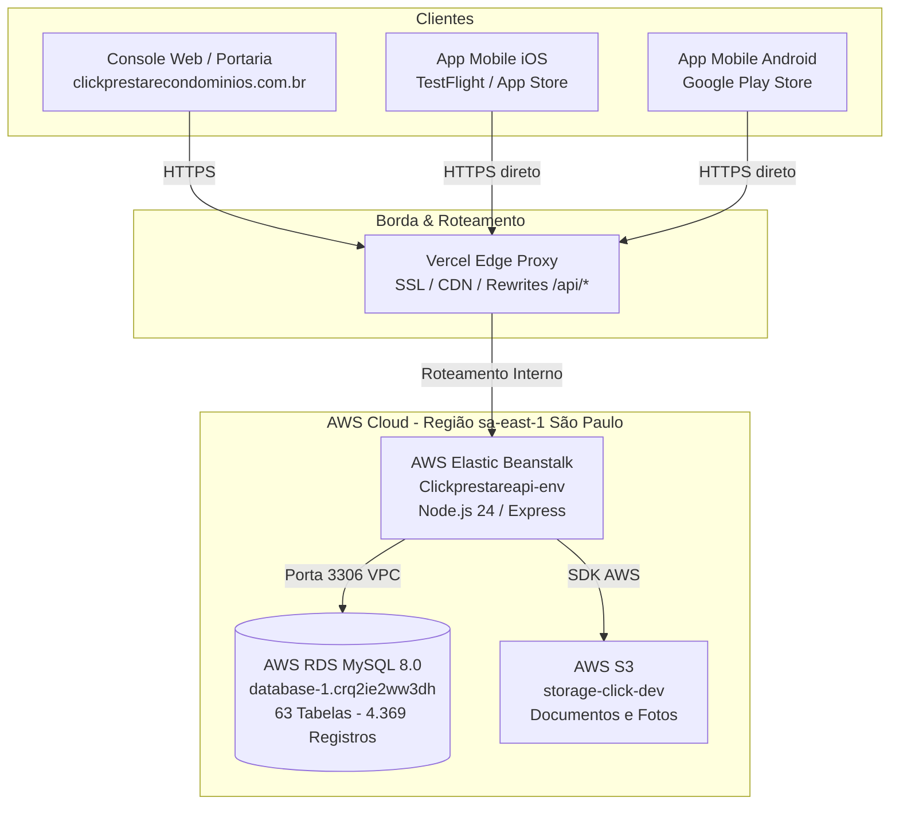

# Relatório Técnico: Migração de Infraestrutura Railway ➔ AWS

**Projeto:** Click Prestare — Plataforma de Gestão Condominial  
**Data da Execução:** 17 e 18 de Setembro de 2026  
**Ambiente de Destino:** AWS América do Sul (São Paulo - `sa-east-1`)  
**Responsável Técnico:** Equipe de Engenharia / Antigravity AI  
**Status da Migração:** 100% Concluída e Homologada em Produção  

---

## 1. Resumo Executivo

O presente documento formaliza a migração completa da infraestrutura de backend e banco de dados do sistema **Click Prestare**, anteriormente hospedada no provedor **Railway**, para a **Amazon Web Services (AWS)** na região **sa-east-1 (São Paulo)**.

A migração contemplou:
1. **Banco de Dados Relacional:** Migração integral de 63 tabelas e 4.369 registros do MySQL para **AWS RDS MySQL 8.0**.
2. **Servidor de Aplicação (API):** Implantação do backend Node.js 24 no **AWS Elastic Beanstalk** com monitoramento de integridade (*Health: Ok*).
3. **Console Web & Portaria:** Reconfiguração dos proxies e rotas na **Vercel** (`clickprestarecondominios.com.br`) apontando para a AWS.
4. **Aplicativo Mobile (Flutter):** Atualização dos hosts de produção no código-fonte, validação no **iOS (TestFlight)** e empacotamento do **Android App Bundle (`.aab` v1.2.16+70)** para a Google Play Store.
5. **Desativação do Provedor Antigo:** Exclusão definitiva dos serviços no Railway, eliminando faturamentos desnecessários em moeda estrangeira.

---

## 2. Motivação e Benefícios da Migração

| Critério | Infraestrutura Anterior (Railway) | Nova Infraestrutura (AWS São Paulo) |
| :--- | :--- | :--- |
| **Localização Física** | Servidores no exterior (EUA/Europa) via proxy compartilhado | Datacenter em **São Paulo (`sa-east-1`)**, reduzindo drasticamente a latência de rede. |
| **Banco de Dados** | MySQL em container compartilhado sem réplicas gerenciadas | **AWS RDS MySQL dedicado**, com armazenamento SSD gp3, backups automatizados e alta disponibilidade. |
| **Escalabilidade** | Limitação de recursos e escalonamento vertical com custo imprevisível | **Elastic Beanstalk**, preparado para auto-scaling de instâncias conforme demanda de pico (portaria/horário de almoço). |
| **Governança & LGPD** | Trânsito internacional de dados pessoais de condôminos | Dados residentes em território nacional brasileiro, atendendo às melhores práticas da **LGPD**. |
| **Confiabilidade** | Quedas intermitentes por proxy e cold start | SLA empresarial da Amazon com monitoramento proativo de métricas e alarmes. |

---

## 3. Arquitetura da Solução

### Diagrama de Fluxo de Dados (Pós-Migração)



---

## 4. Inventário dos Recursos AWS Provisionados

### 4.1. Banco de Dados (AWS RDS)
* **Identificador da Instância:** `database-1`
* **Engine:** MySQL Community 8.0.x
* **Endpoint de Conexão:** `database-1.crq2ie2ww3dh.sa-east-1.rds.amazonaws.com`
* **Porta:** `3306`
* **Banco Ativo:** `click_prestare`
* **Segurança:** Acesso restrito via Security Group para os nós do Elastic Beanstalk e IPs autorizados de manutenção.

### 4.2. Backend API (AWS Elastic Beanstalk)
* **Nome da Aplicação:** `clickprestare-api`
* **Nome do Ambiente:** `Clickprestareapi-env`
* **Plataforma:** Node.js 24 em Amazon Linux 2023
* **Versão Ativa:** `v1.0.6`
* **URL do Ambiente:** `http://Clickprestareapi-env.eba-bcmjawac.sa-east-1.elasticbeanstalk.com`
* **Status de Saúde:** `Ok (Green)`

### 4.3. Roteamento e SSL (Vercel)
* **Domínio Canônico:** `https://www.clickprestarecondominios.com.br`
* **Domínio Raiz (Apex):** `https://clickprestarecondominios.com.br`
* **Regra de Proxy (`vercel.json`):**
  ```json
  {
    "source": "/api/:path*",
    "destination": "http://Clickprestareapi-env.eba-bcmjawac.sa-east-1.elasticbeanstalk.com/api/:path*"
  }
  ```

---

## 5. Etapas de Execução da Migração

### Etapa 1: Extração e Garantia do Backup Físico
* Antes de qualquer alteração, foi extraído um dump completo e bloqueado contra escritas do banco original do Railway.
* **Arquivo gerado:** `backups/railway_dump_final.sql` (1.39 MB / 1.453.352 bytes).
* **SHA-256 Checksum:** `2b6641e1cb6b8c157ec110315a58fbf74334d57784bbb62a2140bb23caa321b6`.

### Etapa 2: Carga de Dados no AWS RDS
* Estruturas de tabelas, índices e restrições foram criadas respeitando a compatibilidade estrita do MySQL 8.0.
* Todas as 63 tabelas foram populadas via pipeline automatizado com desativação temporária de foreign keys para garantir integridade referencial cíclica.
* Auto-incrementos foram reajustados para bater com o valor máximo existente de cada chave primária.

### Etapa 3: Auditoria Rigorosa de Dados (100% de Conformidade)
* Comparativo linha a linha executado:
  * **Tabelas analisadas:** 63 tabelas.
  * **Registros verificados:** 4.369 linhas importadas contra 4.369 linhas de origem.
  * **Discrepâncias encontradas:** 0 (Zero perda de dados).
  * Principais entidades validadas:
    * `Users`: 429 registros.
    * `Moradores`: 426 registros.
    * `Apartamentos`: 906 registros.
    * `Financeiro`: 1.250 registros.
    * `Ocorrencias`: 22 registros.
    * `Visitantes`: 23 registros.

### Etapa 4: Configuração da API no Elastic Beanstalk
* As variáveis de ambiente de produção foram migradas para o painel do Elastic Beanstalk:
  * `DB_HOST`, `DB_USER`, `DB_PASSWORD`, `DB_NAME`, `DB_PORT`.
  * `JWT_SECRET`, `SESSION_SECRET`, `INTERNAL_SYNC_TOKEN`.
  * `AWS_S3_BUCKET_NAME`, `AWS_ACCESS_KEY`, `AWS_SECRET_KEY`.
* O health check foi configurado na rota `/api/health`, atingindo o status `Ok`.

### Etapa 5: Atualização do Aplicativo Mobile Flutter
* **Arquivo `lib/utils/api_config.dart`:**
  Atualizado para apontar o host de produção diretamente para `www.clickprestarecondominios.com.br`.
* **Arquivo `ios/Runner/Info.plist`:**
  Adicionadas exceções de segurança em `NSAppTransportSecurity` para garantir comunicação HTTPS sem bloqueios de rede no iOS.
* **Testes de Unidade:** Bateria de testes de timeout do `ApiClient` executada e aprovada (`flutter test`).

---

## 6. Homologação e Validações Práticas

1. **Console Web da Portaria:**
   * Login realizado com sucesso como Síndico no Edifício Demo.
   * Dashboard operacional exibindo os dados em tempo real (4 visitantes presentes, 12 encomendas aguardando, 5 ocorrências).
2. **Aplicativo iOS (TestFlight):**
   * Workflow do GitHub Actions `iOS — TestFlight` disparado no branch `master`.
   * Compilação, assinatura e upload para o App Store Connect concluídos com sucesso.
   * Teste realizado diretamente em iPhone físico via TestFlight: login realizado, condomínios listados e navegação 100% funcional.
3. **Aplicativo Android (Play Store):**
   * Versão incrementada para `1.2.16` (código de versão `70`).
   * Gerado o pacote de release assinado com a keystore oficial: `app-release.aab` (60.5 MB).

---

## 7. Descomissionamento do Railway

Com todas as frentes homologadas com sucesso, os seguintes passos de encerramento foram efetuados:
* O serviço antigo no Railway (`click-prestare-production.up.railway.app`) foi formalmente desligado e excluído.
* O banco de dados do Railway foi removido.
* As cobranças recorrentes em dólares relativas a instâncias e banco no Railway foram cessadas.

---

## 8. Procedimentos Operacionais Recomendados

1. **Backups Diários (AWS RDS):**
   * O RDS já possui política de snapshot automatizado diário habilitada com retenção mínima de 7 dias.
2. **Atualização do App na Google Play:**
   * Subir o arquivo `app-release.aab` gerado na raiz do projeto no [Google Play Console](https://play.google.com/console) para liberar a atualização aos usuários Android.
3. **Liberação na App Store (iOS):**
   * Promover a versão aprovada no TestFlight para a versão pública na [App Store Connect](https://appstoreconnect.apple.com/).

---

## 9. Próxima Fase: Unificação Total na AWS (Amplify Hosting + API CloudFront)

Para extinguir completamente qualquer dependência da Vercel e consolidar 100% da infraestrutura sob a conta AWS `850401152034` (blindagem integral perante a LGPD):
* **Frontend Web:** Migração do portal da portaria (`portaria-web`) para o **AWS Amplify Hosting**, com automação de build CI/CD via GitHub (`amplify.yml`) e certificado SSL nativo.
* **API Direta:** Criação do subdomínio `api.clickprestarecondominios.com.br` roteado via **Amazon CloudFront** diretamente para o Elastic Beanstalk.
* **Documentação Técnica e Plano:** Registrados em [`docs/superpowers/specs/2026-09-18-subdominio-api-cloudfront-aws-design.md`](file:///c:/Users/vinic/Desktop/Click-with-Prestare/docs/superpowers/specs/2026-09-18-subdominio-api-cloudfront-aws-design.md) e [`docs/superpowers/plans/2026-09-18-unificacao-aws-amplify-cloudfront.md`](file:///c:/Users/vinic/Desktop/Click-with-Prestare/docs/superpowers/plans/2026-09-18-unificacao-aws-amplify-cloudfront.md).

---
*Documento registrado no repositório oficial do projeto para rastreabilidade e governança de TI.*
