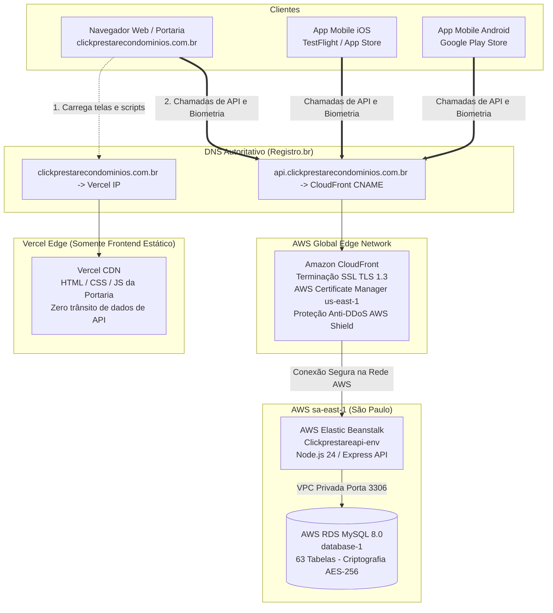

# Especificação de Design: Roteamento Direto de API e Biometria via AWS CloudFront

**Status:** Aprovado em Brainstorming  
**Data:** 18 de Setembro de 2026  
**Autor:** Antigravity AI / Engenharia Prestare  
**Ambiente:** AWS CloudFront + ACM + Elastic Beanstalk (`sa-east-1`) + Registro.br  
**Objetivo:** Eliminar 100% do trânsito de dados pessoais e biometria facial pela infraestrutura da Vercel, direcionando todas as chamadas de API diretamente para a nuvem da AWS sob o subdomínio `api.clickprestarecondominios.com.br`.

---

## 1. Contexto e Motivação

Atualmente, o frontend da portaria web é hospedado na Vercel (`clickprestarecondominios.com.br`). Por conveniência arquitetural inicial, a Vercel foi configurada com uma regra de rewrite em seu arquivo de borda (`vercel.json`):
```json
{
  "source": "/api/:path*",
  "destination": "http://Clickprestareapi-env.eba-bcmjawac.sa-east-1.elasticbeanstalk.com/api/:path*"
}
```

Embora o Vercel seja *stateless* e **não armazene nenhum dado**, a cláusula padrão de uso da Vercel veda o trânsito de categorias especiais/dados sensíveis (*"Sensitive Data or Special Categories of Data"*). Para fins de conformidade estrita com a **LGPD (Art. 5º, II e Art. 46)** e para garantir um dossiê de auditoria 100% incontestável perante síndicos e assessoria jurídica, projeta-se a segregação total entre:
1. **Frontend Estático (Vercel):** Exclusivamente para servir arquivos HTML, CSS e JavaScript compilados;
2. **Backend API e Banco de Dados (AWS):** Recepção de todas as requisições, biometrias, fotos e registros operacionais sob o subdomínio direto `https://api.clickprestarecondominios.com.br`.

---

## 2. Arquitetura da Solução

### 2.1 Diagrama de Fluxo de Dados



---

## 3. Especificação Detalhada dos Componentes

### 3.1. Certificado Digital SSL (AWS Certificate Manager — ACM)
* **Região Obrigatória:** **`us-east-1` (N. Virginia)**.
  > **Requisito Técnico Estrito da AWS:** Para distribuições do Amazon CloudFront com domínio personalizado, o certificado SSL/TLS **obrigatoriamente** deve ser emitido na região `us-east-1` do ACM, independentemente de os servidores de origem residirem em São Paulo (`sa-east-1`). Certificados criados em São Paulo não aparecem na listagem do CloudFront.
* **Nome de Domínio Solicitado:** `api.clickprestarecondominios.com.br`
* **Tipo de Validação:** Validação por DNS (registro CNAME no Registro.br).
* **Renovação:** Totalmente automatizada pela Amazon antes do vencimento anual.

### 3.2. Distribuição Amazon CloudFront
* **Origem (Origin Domain):** `Clickprestareapi-env.eba-bcmjawac.sa-east-1.elasticbeanstalk.com`
* **Protocolo de Origem:** HTTP (porta 80) — o CloudFront comunica-se com a instância através do backbone dedicado da AWS.
* **Nomes de Domínio Alternativos (CNAMEs):** `api.clickprestarecondominios.com.br`
* **Certificado SSL do Visualizador:** Selecionar o certificado emitido no ACM em `us-east-1`.
* **Configuração de Comportamento (Default Cache Behavior):**
  * **Viewer Protocol Policy:** `Redirect HTTP to HTTPS` (garante que nenhuma requisição não criptografada trafegue).
  * **Allowed HTTP Methods:** `GET, HEAD, OPTIONS, PUT, POST, PATCH, DELETE`.
  * **Cache Policy:** `Managed-CachingDisabled` (ID `4135ea2d-6df8-44a3-9df3-4b5a84be39ad`).
    * *Justificativa:* A API do Prestare é transacional, em tempo real e com autenticação baseada em tokens JWT. Nenhuma chamada de API deve ser mantida em cache de borda.
  * **Origin Request Policy:** `Managed-AllViewerExceptHostHeader` (ID `b689b0a8-53d0-40ab-baf2-68738e2966ac`).
    * *Justificativa:* Repassa todos os headers de requisição (`Authorization`, `Content-Type`, `Cookie`, query strings), substituindo o header `Host` pelo domínio do Elastic Beanstalk para aceitação correta no servidor Nginx/Node.js da AWS.
* **Proteção:** AWS Shield Standard habilitado por padrão (sem custo).

### 3.3. Configuração de DNS no Registro.br
No painel do domínio `clickprestarecondominios.com.br` no **Registro.br**, serão adicionados dois registros:

| Tipo | Nome | Destino / Valor | Finalidade |
| :--- | :--- | :--- | :--- |
| **CNAME** | `_xxxxxxxxxxxx.api` | `_yyyyyyyyyyyy.acm-validations.aws.` | Validação criptográfica do certificado ACM |
| **CNAME** | `api` | `dXXXXXXXXXXXXX.cloudfront.net.` | Apontamento do subdomínio para a distribuição CloudFront |

---

## 4. Ajustes no Código e Clientes

### 4.1. Aplicativo Mobile Flutter (`click-cond-app`)
No arquivo `lib/utils/api_config.dart`, atualizar o host de produção:
```dart
class ApiConfig {
  static const bool isProduction = true;

  static String get host {
    if (isProduction) return "api.clickprestarecondominios.com.br";
    if (kIsWeb) return "localhost:3003";
    return "10.0.2.2:3003";
  }
  ...
}
```

### 4.2. Console Web Portaria (`click-cond-web`)
No frontend Angular da portaria (`apps/portaria-web`), as chamadas de API devem ser configuradas para o endpoint completo da API:
* Em desenvolvimento: `http://localhost:3003/api`
* Em produção: `https://api.clickprestarecondominios.com.br/api`

### 4.3. Configuração de CORS no Backend Node.js (`click-cond-api`)
Certificar que a lista de origens autorizadas no Express permite o domínio da web:
```javascript
const allowedOrigins = [
  'https://clickprestarecondominios.com.br',
  'https://www.clickprestarecondominios.com.br',
  'http://localhost:4200'
];
```

### 4.4. Limpeza no `vercel.json`
Com o subdomínio direto ativo, a regra de rewrite no Vercel torna-se desnecessária:
```json
{
  "version": 2,
  "rewrites": [
    {
      "source": "/sobre",
      "destination": "/sobre/index.html"
    },
    {
      "source": "/:path*",
      "destination": "/index.html"
    }
  ]
}
```

---

## 5. Estratégia de Transição Suave (Zero Downtime)

Para garantir que a transição ocorra sem qualquer indisponibilidade para os usuários ou aplicativos já instalados:

1. **Fase 1 — Provisionamento Paralelo:** Criar o certificado ACM e a distribuição CloudFront sem tocar no código de produção.
2. **Fase 2 — Testes de Homologação:** Testar os endpoints diretamente via `curl`:
   ```bash
   curl -I https://api.clickprestarecondominios.com.br/api/health
   ```
3. **Fase 3 — Manutenção do Rewrite Vercel como Fallback:** Manter o rewrite no `vercel.json` por um período de transição (ex.: 30 dias) para atender clientes com versões móveis legadas ainda não atualizadas.
4. **Fase 4 — Deploy das Novas Versões:** Publicar o app mobile e o painel web apontando para `api.clickprestarecondominios.com.br`.
5. **Fase 5 — Desativação Definitiva do Rewrite:** Remover a regra do `vercel.json` após a consolidação das atualizações.

---

## 6. Dimensionamento e Custos (Capacidade para até 10 Condomínios)

* **Volume de Requisições Estimado (10 Condomínios):** ~20.000 a 45.000 requisições diárias (~1,3 milhão/mês).
* **AWS CloudFront Free Tier:**
  * 1.000.000 de requisições HTTP/HTTPS gratuitas todo mês (para sempre).
  * 1 TB de transferência de dados de saída gratuito todo mês.
* **Custo Adicional Mensal:** **US$ 0,00 a US$ 0,35** (praticamente zero reais).
* **Comparação com ALB (Load Balancer):** Economia de ~US$ 18 a 22/mês (~R$ 1.300,00/ano).

---

## 7. Conclusão e Próximos Passos

Esta arquitetura confere à Prestare Gestão:
1. **Blindagem Jurídica Completa sob a LGPD:** O Vercel fica 100% fora da rota de biometria e dados pessoais;
2. **Performance Máxima:** Latência mínima com terminação SSL na borda brasileira do CloudFront;
3. **Custo Otimizado:** Custo operacional irrisório perfeitamente calibrado para a escala de até 10 condomínios.

*Documento aprovado em fase de planejamento, pronto para execução técnica quando demandado pela equipe.*
