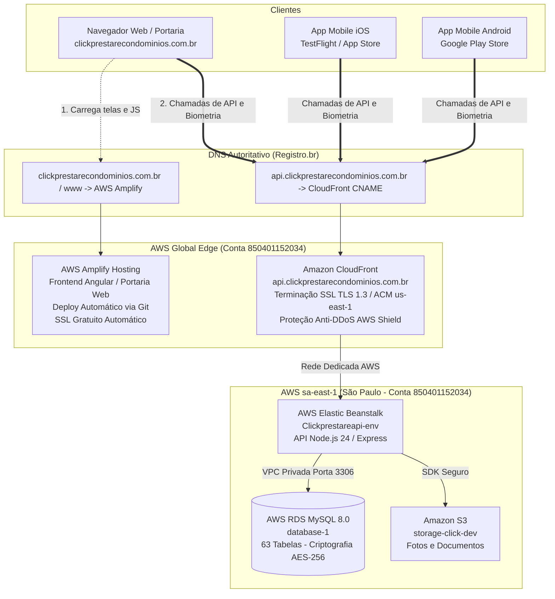

# Especificação de Design: Arquitetura 100% AWS (AWS Amplify Hosting + API via CloudFront)

**Status:** Aprovado em Brainstorming  
**Data:** 18 de Setembro de 2026  
**Autor:** Antigravity AI / Engenharia Prestare  
**Conta AWS Oficial:** `850401152034`  
**Escopo:** Consolidação Integral na AWS — Substituição Definitiva do Vercel pelo **AWS Amplify Hosting** e Roteamento Direto da API via **Amazon CloudFront**.

---

## 1. Contexto e Motivação da Eliminação do Vercel

O sistema Prestare já migrou com sucesso o banco de dados (RDS) e o backend (Elastic Beanstalk) do Railway para a AWS. Atualmente, a única ponta fora do ecossistema Amazon é a **Vercel**, que hospeda os arquivos visuais da portaria web e atua como proxy reverso provisório de chamadas.

### Por que eliminar a Vercel e adotar o AWS Amplify Hosting:
1. **Unificação em 1 Único Fornecedor:** Elimina a fragmentação de serviços. Todo o ecossistema (Frontend, API, Banco, Arquivos e DNS) passa a residir dentro da conta **AWS `850401152034`**.
2. **Segurança Jurídica Absoluta (LGPD):** A Vercel é 100% removida do fluxo. A assessoria jurídica e os contratos dos condomínios passam a listar **exclusivamente a Amazon Web Services (AWS Brasil)** como suboperadora de nuvem.
3. **Mesma Experiência de Deploy com Automação Git:** O **AWS Amplify Hosting** oferece exatamente as mesmas facilidades do Vercel: conecta ao repositório GitHub da Prestare, compila o código Angular a cada `git push` e distribui com certificado SSL automático e CDN global da Amazon.

---

## 2. Arquitetura 100% AWS

### 2.1 Diagrama de Fluxo de Dados



---

## 3. Especificação dos Componentes da Solução

### 3.1. Frontend: AWS Amplify Hosting (Substituição da Vercel)
* **Serviço AWS:** AWS Amplify Hosting (Web Apps).
* **Conexão com Repositório:** Conectado diretamente ao repositório GitHub `ViniciusVilelaRufini/Click-Prestare`, branch `main`.
* **Gatilho de Deploy (CI/CD):** A cada `git push` no branch `main`, o Amplify inicia o pipeline automatizado de build.
* **Configuração de Build (`amplify.yml`):**
  ```yaml
  version: 1
  frontend:
    phases:
      preBuild:
        commands:
          - cd click-cond-web
          - npm ci
      build:
        commands:
          - npm run build
    artifacts:
      baseDirectory: click-cond-web/dist/apps/portaria-web/browser
      files:
        - '**/*'
    cache:
      paths:
        - click-cond-web/node_modules/**/*
  ```
* **Regras de Redirecionamento e Rewrite no Amplify (SPA Angular):**
  Para que a navegação do Angular (ex.: `/dashboard`, `/sobre`, `/login`) funcione em reload sem retornar erro 404:
  * **Source address:** `</^[^.]+$|\.(?!(css|gif|ico|jpg|js|png|txt|svg|woff|woff2|ttf|map|json|webmanifest)$)([^.]+$)/>`
  * **Target address:** `/index.html`
  * **Type:** `200 (Rewrite)`
  * **Redirecionamento Raiz -> WWW:** `https://clickprestarecondominios.com.br` ➔ `https://www.clickprestarecondominios.com.br` (`301 Redirect`).
* **Domínios Personalizados no Amplify:**
  * `clickprestarecondominios.com.br` (domínio raiz)
  * `www.clickprestarecondominios.com.br` (com redirecionamento automático configurado)
* **Certificado SSL:** Emitido e renovado de forma 100% automática pela AWS (Let's Encrypt / ACM integrado).

---

### 3.2. Backend: Subdomínio de API com Amazon CloudFront + ACM
* **Nome do Subdomínio:** `api.clickprestarecondominios.com.br`
* **Certificado SSL:** AWS Certificate Manager (ACM) criado na região `us-east-1` (exigência técnica do CloudFront para bordas).
* **Distribuição CloudFront:**
  * **Origem:** `Clickprestareapi-env.eba-bcmjawac.sa-east-1.elasticbeanstalk.com`
  * **Política de Protocolo:** `Redirect HTTP to HTTPS` (TLS 1.2/1.3 forçado).
  * **Allowed Methods:** `GET, HEAD, OPTIONS, PUT, POST, PATCH, DELETE`.
  * **Cache Policy:** `Managed-CachingDisabled` (ID `4135ea2d-6df8-44a3-9df3-4b5a84be39ad`) — tráfego 100% transacional dinâmico sem retenção em borda.
  * **Origin Request Policy:** `Managed-AllViewerExceptHostHeader` — repassa cabeçalhos JWT de autenticação (`Authorization`), mantendo conformidade com o Nginx da AWS.

---

### 3.3. Configuração de DNS no Registro.br (Sem Vercel)

Com a saída da Vercel, a zona de DNS no **Registro.br** é totalmente orientada para a Amazon:

| Tipo | Nome | Destino / Valor | Finalidade |
| :--- | :--- | :--- | :--- |
| **CNAME** | `www` | `xxxx.amplifyapp.com.` | Frontend Web no AWS Amplify |
| **A / ALIAS** | `@` (raiz) | IP / CNAME do AWS Amplify | Acesso direto sem www |
| **CNAME** | `api` | `dXXXXXXXXXXXXX.cloudfront.net.` | Endpoint da API no CloudFront |
| **CNAME** | `_acm.api` | `_yyy.acm-validations.aws.` | Validação SSL da API no ACM |

---

## 4. Ajustes no Código dos Aplicativos e Web

1. **App Mobile (`click-cond-app`):**
   * Em `lib/utils/api_config.dart`:
     ```dart
     static String get host {
       if (isProduction) return "api.clickprestarecondominios.com.br";
       ...
     }
     ```
2. **Console Web (`click-cond-web`):**
   * Configuração de ambiente (`environment.prod.ts`):
     ```typescript
     export const environment = {
       production: true,
       apiUrl: 'https://api.clickprestarecondominios.com.br/api'
     };
     ```
3. **Backend Node.js (`click-cond-api`):**
   * Liberar os domínios do Amplify no CORS do Express:
     ```javascript
     const allowedOrigins = [
       'https://clickprestarecondominios.com.br',
       'https://www.clickprestarecondominios.com.br'
     ];
     ```
4. **Descomissionamento do Vercel:**
   * Exclusão do projeto na Vercel e encerramento da conta, sem qualquer impacto residual.

---

## 5. Estimativa de Custos para até 10 Condomínios

| Serviço | Função | Nível Gratuito / Custo Mensal Estimado |
| :--- | :--- | :--- |
| **AWS Amplify Hosting** | Frontend Web e Portaria | **US$ 0,00 a US$ 1,50/mês** (Free Tier cobre 1.000 min de build e 15 GB servidos/mês). |
| **Amazon CloudFront** | Roteador e SSL da API | **US$ 0,00/mês** (Free Tier perpétuo cobre até 1.000.000 reqs/mês). |
| **AWS ACM** | Certificados SSL | **Gratuito** fornecido pela Amazon. |
| **Elastic Beanstalk + RDS** | API e Banco MySQL | Já ativos na conta `850401152034`. |
| **Custo Total Adicional:** | — | **Aproximadamente R$ 0,00 a R$ 8,00/mês**. |

---

## 6. Roteiro Prático de Execução

1. **Etapa 1:** Solicitar certificado ACM para `api.clickprestarecondominios.com.br` no painel AWS (`us-east-1`).
2. **Etapa 2:** Criar distribuição CloudFront apontando para o Elastic Beanstalk.
3. **Etapa 3:** Criar novo App no **AWS Amplify Console**, conectando ao repositório GitHub na branch `main`.
4. **Etapa 4:** Validar o build do painel web no Amplify e associar o domínio `clickprestarecondominios.com.br`.
5. **Etapa 5:** Atualizar as entradas de DNS no **Registro.br** (apontando web para o Amplify e api para o CloudFront).
6. **Etapa 6:** Testar acessos ponta a ponta e deletar definitivamente o projeto no painel da Vercel.

---

## 7. Conclusão

Com a implementação deste design, a **Prestare Gestão** atinge **100% de soberania e independência dentro da AWS**:
* Zero dependência do Railway;
* Zero dependência do Vercel;
* 1 único painel, 1 única fatura, 1 único contrato sob a conta AWS `850401152034` com total respaldo perante a LGPD.
